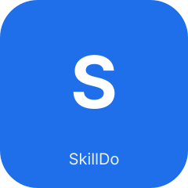

<a id="readme-top"></a>

<p align="center">
  <a href="https://github.com/yancongya/skilldo">
    
  </a>
</p>

<h1 align="center">SkillDo</h1>

<p align="center">
  <a href="https://github.com/yancongya/skilldo/actions"></a>
  <a href="https://github.com/yancongya/skilldo/releases"></a>
  <a href="https://github.com/yancongya/skilldo/blob/main/LICENSE"></a>
  <a href="https://github.com/yancongya/skilldo"></a>
  <a href="https://github.com/yancongya/skilldo/stargazers"></a>
</p>

<p align="center">
  <b>Install once, sync everywhere.</b> The agent-native skill manager for 45 AI coding tools.
  <br />
  <a href="docs/README.zh.md"><strong>简体中文</strong></a>
</p>

> [!NOTE]
> This README and the Chinese version (`docs/README.zh.md`) are kept structurally mirrored — same section outline, same tool count (45), same terminology. Use `readme-please`'s `check_bilingual_headings.py` to verify.

---

## Table of Contents

<details>
  <summary>Click to expand</summary>

- [About the Project](#about-the-project)
- [Features](#features)
- [Quick Start](#quick-start)
- [CLI Commands](#cli-commands)
- [Architecture](#architecture)
- [Cross-device Profiles](#cross-device-profiles)
- [Supported Tools](#supported-tools)
- [Build Scripts](#build-scripts)
- [Tech Stack](#tech-stack)
- [Roadmap](#roadmap)
- [FAQ](#faq)
- [Supported Platforms](#supported-platforms)
- [Contributing](#contributing)
- [License](#license)

</details>

---

## About the Project

SkillDo manages AI Agent Skills from a single source of truth (the Central Repo) and syncs them to all your coding tools. Use the **CLI** for automation, the **desktop app** for visual management, or let **agents** drive it programmatically via structured JSON output.

**Why SkillDo:**
- *One source of truth* — install a skill once in the Central Repo, sync everywhere (symlink → junction → copy triple fallback).
- *45 AI tools, one workflow* — Claude Code, Codex, Cursor, Windsurf, WorkBuddy, and 40 more, with per-tool global/project-level targets.
- *Agent-native* — every command speaks `--json`; agents discover `skilldo` via `SKILL.md` in their skill directories.

<p align="right">(<a href="#readme-top">back to top</a>)</p>

## Features

- **Explore**: browse curated skills and search online, install and sync to all detected tools in one click.
- **Tags**: create, rename, and delete custom tags on a dedicated page; jump to the matching skill list.
- **Tag filtering**: tag skills and filter My Skills by tag, including `no-tag` skills.
- **Global / project-level sync**: sync to the global directory (all projects) or scope to a single project.
- **Sync scope control**: switch a skill between global and project scope, manage project directories, filter by scope.
- **Skill detail**: click a skill to view full file content with tree browser, Markdown rendering, and 40+ language syntax highlighting.
- **Unified view**: see total Hub-hosted skills, scope badges, and per-tool生效 status.
- **Migration takeover**: scan tools' existing skills, import them into the Central Repo, and sync in one click.
- **Multi-source import**: local directory / Git URL (with searchable multi-skill candidate selection and `.claude/skills/` support).
- **Update**: pull from source into the Central Repo and back-fill copy-mode targets.
- **New-tool detection**: prompt to sync all managed skills when a new tool is detected.

<p align="right">(<a href="#readme-top">back to top</a>)</p>

## Quick Start

### Install without cloning

Download the desktop installer from [GitHub Releases](https://github.com/yancongya/skilldo/releases), or install the standalone CLI directly:

```bash
# macOS (Apple Silicon or Intel; detects the architecture and verifies SHA-256)
curl -fsSL https://raw.githubusercontent.com/yancongya/skilldo/main/scripts/install-cli.sh | bash
```

```powershell
# Windows PowerShell (x64 or ARM64; detects the architecture and verifies SHA-256)
irm https://raw.githubusercontent.com/yancongya/skilldo/main/scripts/install-cli.ps1 | iex
```

The release provides `skilldo-cli-macos-aarch64.tar.gz`, `skilldo-cli-macos-x86_64.tar.gz`, `skilldo-cli-windows-x64.zip`, and `skilldo-cli-windows-arm64.zip`, each with a `.sha256` file. Cloning the source repository is only required for development.

### CLI (recommended for agents & automation)

```bash
# Install from GitHub
skilldo install --url https://github.com/anthropics/skills/tree/main/skills/skill-creator --yes

# Sync to all tools
skilldo sync --skill skill-creator --tool claude_code
skilldo sync --skill skill-creator --tool codex

# Check status
skilldo list --json
skilldo status --json
skilldo author detect --apply --json
skilldo project skills --path . --json

# Update all git-managed skills
skilldo update --all --yes

# Complete cross-device pipelines
skilldo device status --json
skilldo device pull --json
skilldo device publish --yes --json

# Browse the skill market
skilldo explore --query "rag" --json
```

### Desktop App

Download the `.dmg` for macOS or `.exe` for Windows from [Releases](https://github.com/yancongya/skilldo/releases). The GUI provides visual skill management, explore, and one-click sync. Linux can currently be built from source but is not part of the release matrix.

The desktop app checks for updates after startup and shows the Chinese release notes when a newer version is available. macOS users can download, install, and relaunch from the prompt. On Windows, the NSIS updater exits the running app automatically before installation. Manual checks remain available under **Settings → App updates**.

Because the updater signing key was established in v0.7.1, installations older than v0.7.1 must install a current release manually once. Windows v0.7.1 also requires one manual upgrade to the first release that includes the Windows updater manifest. Do not rotate the updater key for ordinary releases; losing it breaks the trusted update chain for installed clients.

### Development

```bash
git clone https://github.com/yancongya/skilldo.git
cd skilldo
npm install
npm run tauri:dev          # Desktop app (GUI + Rust backend)
npm run dev                # Web preview only (no backend)
./scripts/build.sh         # Build for current platform
```

<p align="right">(<a href="#readme-top">back to top</a>)</p>

## CLI Commands

All commands support `--json` for agent-friendly structured output and `--yes` to skip confirmations. The desktop buttons and `scripts/skilldo-pull|publish` (`.sh`/`.bat`) call the same shared pipeline.

<details>
  <summary>Show all commands</summary>

| Command | Description |
|---------|-------------|
| `skilldo list [--json]` | List managed skills and sync targets |
| `skilldo status [--json]` | Show which of 45 AI tools are installed |
| `skilldo device status\|pull\|publish [--yes] [--json]` | Inspect, retrieve, or publish complete cross-device state |
| `skilldo author status\|detect\|set [--json]` | Detect or configure the current environment author without exposing the `gh` token |
| `skilldo project skills [--path <project>] [--json]` | Discover project-local Skills with parent Git repository, revision, and repository-relative paths |
| `skilldo explore [--query Q] [--json]` | Browse the skill market |
| `skilldo install --url <repo> [--name] [--yes]` | Install from git URL or local path |
| `skilldo sync --skill <name> --tool <key> [--scope project --project-path <path>]` | Sync globally or into one project |
| `skilldo unsync --skill <name> --tool <key> [--scope project --project-path <path>]` | Remove a global or project target |
| `skilldo config get\|set <key> [value] [--stdin] [--json]` | Read/write scalar or structured config; use stdin for secrets |
| `skilldo update --skill <name> [--yes]` | Update from source (auto git pull) |
| `skilldo update --all [--yes]` | Update all git-managed skills |
| `skilldo delete --skill <name> [--yes]` | Delete skill and all targets |
| `skilldo push --skill <name> [-m "msg"]` | Commit & push git-managed skill |
| `skilldo sources list [--json]` | List explore sources |
| `skilldo backup file [path] [--json]` | Export a lossless SQLite snapshot in one JSON file |
| `skilldo backup webdav [--json]` | Upload the lossless snapshot, including configured credentials |
| `skilldo restore file <path> [--json]` | Validate and restore a local snapshot |
| `skilldo restore webdav [--json]` | Validate and restore the WebDAV snapshot |
| `skilldo profile status [--json]` | Preview the WebDAV profile merge without writing |
| `skilldo profile sync [--yes] [--json]` | Merge, pull, install, and sync the shared device profile |
| `skilldo repair sources [--apply] [--json]` | Audit local records and promote verified Git-worktree sources |
| `skilldo repair source --skill <name> --url <repo> [--subpath <path>] [--apply] [--json]` | Verify a remote Skill identity, then reconnect one source |
| `skilldo profile export <path> [--json]` | Export a portable Profile without WebDAV |
| `skilldo profile import <path> [--strategy abort\|local\|remote] [--json]` | Merge an offline Profile |
| `skilldo profile resolve --strategy local\|remote [--json]` | Resolve current WebDAV conflicts and synchronize |

</details>

<p align="right">(<a href="#readme-top">back to top</a>)</p>

## Architecture

```
┌─────────────┐     ┌─────────────┐     ┌──────────────┐
│  CLI (clap)  │     │  GUI (React)│     │  Agent scripts│
└──────┬──────┘     └──────┬──────┘     └──────┬───────┘
       │                   │                    │
       └─────────┬─────────┘                    │
                 │                              │
          ┌──────▼──────┐              ┌────────▼────────┐
          │  core/ (Rust)│◄─────────────│  SKILL.md      │
          │  Pure logic  │              │  Agent discovery│
          └──────┬──────┘              └─────────────────┘
                 │
          ┌──────▼──────┐
          │   SQLite     │
          │  (shared db) │
          └──────────────┘
```

- **Three front-ends** share one `core/` engine and one SQLite database
- CLI and GUI state stay in sync automatically
- Agents discover `skilldo` via `SKILL.md` in their skill directories

<p align="right">(<a href="#readme-top">back to top</a>)</p>

## Cross-device Profiles

On every new device, install either the desktop app or standalone CLI, then configure the same WebDAV endpoint. The NAS filesystem path is not entered on clients; use its HTTPS WebDAV URL and remote directory.

```bash
skilldo config set webdav.url "https://dav.example.com" --json
skilldo config set webdav.user "username" --json
printf '%s' 'password' | skilldo config set webdav.password --stdin --json
skilldo config set webdav.remote_dir "services/skillsdo" --json

# Verify the saved non-secret values and test remote Profile access
skilldo config get webdav --json
skilldo device status --json

# Retrieve and merge the shared state
skilldo device pull --json
```

In the desktop app, enter the same values under Settings → WebDAV, save them, choose **Check device state**, then **Get updates from other devices**. To publish changes back after reviewing them, use **Publish to other devices** or `skilldo device publish --yes --json`.

The versioned `skilldo-profile.json` stores portable desired state: Git/package Skill sources and revisions, standard global targets, tags, manual origin rules, language, cache policy, and Explore sources. Git-managed Skills are cloned or pulled on the receiving computer. Independent Skill lists, tags, and targets are merged as a union.

Passwords, WebDAV credentials, storage paths, custom scan directories, per-tool path overrides, project targets, and local-only Skills never enter the Profile. A new device must enter WebDAV credentials once before it can download anything. `config get` deliberately redacts the password. Deletions are reported as pending unless explicitly confirmed. Concurrent edits are merged against each device's last synchronized base; the upload uses WebDAV ETags to prevent overwriting a newer remote revision.

If an older import was incorrectly recorded as local, run `skilldo repair sources --json` first. The audit reads standard `.agents/.skill-lock.json` provenance, content-matched Codex plugin manifests, and real Git worktrees. Review the structured report, then use `skilldo repair sources --apply --json`. Ambiguous central copies remain unresolved. For a confirmed source that lacks local metadata, use `repair source`; SkillDo clones the remote and verifies the selected directory contains a matching `SKILL.md` before writing.

The separate `skilldo-backup.json` v2 format embeds a consistent SQLite image as Base64 with a SHA-256 checksum. It preserves every database table, ID, timestamp, setting, tag, origin record, target, discovery row, index, and sequence. At the user's request it also includes GitHub and WebDAV credentials, so the backup location must be private. Repository working trees and local-only skill files are filesystem content, not database data; use the Profile/Git flow to reconstruct repository skills on another computer.

<p align="right">(<a href="#readme-top">back to top</a>)</p>

## Supported Tools

SkillDo supports **45** AI coding tools. Project-level skill directories are relative to the selected project root. Tools marked "not supported" have no confirmed project-level skill directory and only support global sync.

The full table with per-tool global/project-level paths and detection rules is maintained in the [Chinese README](docs/README.zh.md#支持的-ai-编程工具) and in [`src-tauri/src/core/tool_adapters/mod.rs`](src-tauri/src/core/tool_adapters/mod.rs).

Representative tools: WorkBuddy, Claude Code, Codex, Cursor, OpenCode, Cline, Augment, OpenClaw, Gemini CLI, Kiro CLI, iFlow, Qoder, Qwen Code, Antigravity, Pi, Amp, Continue, Windsurf, GitHub Copilot, Trae, Roo Code, and more.

> Tool count is generated from source via `readme-writer`'s `gen_tool_table.py` — keep it in sync, do not hand-edit.

<p align="right">(<a href="#readme-top">back to top</a>)</p>

## Build Scripts

```bash
./scripts/build.sh            # macOS DMG
./scripts/build.sh universal  # Universal DMG (Intel + Apple Silicon)
./scripts/build.sh cli        # CLI binary only
./scripts/build.sh release    # Build + install CLI to ~/.local/bin
./scripts/build.sh win        # Windows NSIS installer
./scripts/build.sh linux      # Linux AppImage + deb
```

Build artifacts are collected to `out/` with intermediates cleaned up.

Pushes to `main` are released automatically after CI succeeds when changes affect application or CLI code. The automation increments the patch version, promotes the Unreleased changelog into a Chinese version section, creates the tag, and dispatches the existing signed macOS/Windows release workflow. Documentation-only changes, the generated featured catalog, commits containing `[skip release]`, and failed CI runs do not publish a release.

<p align="right">(<a href="#readme-top">back to top</a>)</p>

## Tech Stack

- **Frontend**: React 19 + TypeScript + Vite 7 + Tailwind CSS 4
- **Backend**: Rust (Tauri 2) + SQLite (rusqlite) + libgit2
- **CLI**: clap + same core engine as the desktop app
- **Sync**: Symlink → junction (Windows) → copy (triple fallback)

<p align="right">(<a href="#readme-top">back to top</a>)</p>

## Roadmap

- [x] Desktop app (macOS + Windows) with visual skill management
- [x] Standalone CLI with structured `--json` output
- [x] Cross-device profiles via WebDAV
- [ ] First-class Linux release matrix (deb + AppImage in release pipeline)
- [ ] More AI tools and refined project-level path detection
- [ ] Richer Explore marketplace and curated catalogs

See [open issues](https://github.com/yancongya/skilldo/issues) for the full list.

<p align="right">(<a href="#readme-top">back to top</a>)</p>

## FAQ

- **Where do skills live?** The Central Repo defaults to `~/.skillshub` and is configurable in Settings.
- **What are tags for?** Tags only help you find and organize skills; they do not change a skill's sync directory or which tools can use it.
- **What is project-level sync?** A shared skill is still stored once in the Central Repo; the project directory is just a sync target. Project-owned skills should be committed directly to the parent project's Git repo. The cross-device Profile stores only the repo URL, branch/revision, and repo-relative paths — never another computer's absolute project path.
- **Why is Cursor forced to Copy?** Cursor does not currently support symlink/junction skill directories, so syncing to Cursor always uses directory copy.
- **Why does it sometimes fall back to Copy?** The default is symlink/junction, but on some systems (especially Windows) link creation may fail due to permissions/policy, and SkillDo automatically falls back to directory copy.
- **What does `TARGET_EXISTS|...` mean?** The target directory already exists and is not overwritten by default (for safety). Clean the target first, or retry through the explicit takeover/overwrite flow.
- **macOS Gatekeeper note** (unsigned/unnotarized builds may behave differently across macOS versions): if you see "damaged / cannot verify developer", run `xattr -cr "/Applications/SkillDo.app"` ([ref](https://v2.tauri.app/distribute/#macos)).

<p align="right">(<a href="#readme-top">back to top</a>)</p>

## Supported Platforms

- **macOS** — verified
- **Windows** — expected per architecture, not locally verified
- **Linux** — expected per architecture, not locally verified (build from source)

<p align="right">(<a href="#readme-top">back to top</a>)</p>

## Contributing

1. Fork the repository
2. Create your feature branch (`git checkout -b feature/amazing-feature`)
3. Commit your changes (`git commit -m 'Add some amazing feature'`)
4. Push to the branch (`git push origin feature/amazing-feature`)
5. Open a Pull Request

Please run `npm run check` before submitting. Code changes affecting app/CLI trigger an automatic release after CI; add `[skip release]` to the commit message to suppress it.

<p align="right">(<a href="#readme-top">back to top</a>)</p>

## License

Distributed under the [MIT License](LICENSE).
